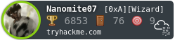

#### About me

* :name_badge: My Website: [dhavalkotak](https://dhavalkotak.github.io/portfolio)
* :blue_book: My Blogs:  [blog](https://dhavalkotak.github.io)
* :mortar_board: Studying Bachelor Of Computer Application
* 🌱 Self Learning Cyber Security and Web Development
* 📫 Send me a Email : [protonmail](mailto:kotakdhaval01@protonmail.com) or [gmail](mailto:kotakdhaval01@gmail.com)

<!--
**DhavalKotak/DhavalKotak** is a ✨ _special_ ✨ repository because its `README.md` (this file) appears on your GitHub profile.

Here are some ideas to get you started:

- 🔭 I’m currently working on ...
- 🌱 I’m currently learning ...
- 👯 I’m looking to collaborate on ...
- 🤔 I’m looking for help with ...
- 💬 Ask me about ...
- 📫 How to reach me: ...
- 😄 Pronouns: ...
- ⚡ Fun fact: ...
-->
